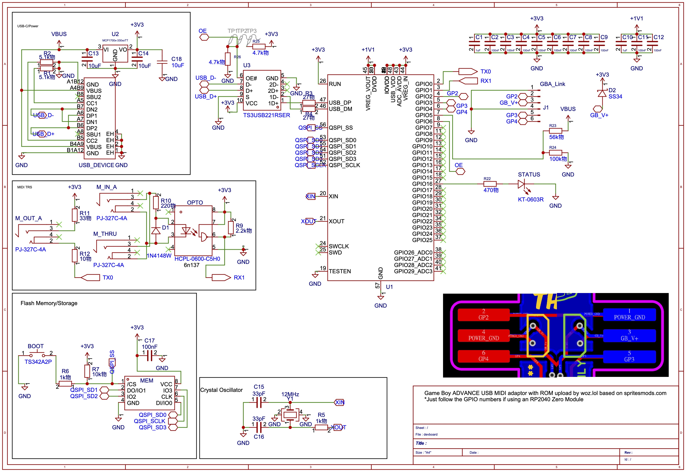

# Woz GBA MIDI

https://woz.lol

RP2040/Arduino sketch for uploading an embedded GBA MIDI multiboot ROM, then forwarding built-in USB MIDI and DIN MIDI to the running GBA program.

This project is based on and adapted from the SpritesMods GBA MIDI project by Jeroen Domburg / Sprite_tm:

https://spritesmods.com/?art=gbamidi

## License

This repository is licensed under Creative Commons Attribution 2.0 Generic (`CC-BY-2.0`). See `LICENSE.md`.

Please preserve attribution to SpritesMods for the original GBA MIDI concept, protocol work, and ROM behavior this adaptation builds on.

## Main Sketch

- `GBA_Midi_RP2040_Woz.ino` is the current working RP2040 sketch.
- It uploads a small embedded GBA stage1 loader over the GBA link port, then streams the larger GBAMIDI2 runtime as stage2 before switching to MIDI forwarding.
- Built-in USB enumerates as a USB MIDI device.
- Current GBAMIDI2 two-stage cable profile:
  - `SC=GPIO2`, `SI=GPIO3`, `SO=GPIO4`
  - The working stage1 BIOS SD path also uses `GPIO4`.
- The sketch only tries the GBAMIDI2 GBC-cable profile and only enters MIDI mode after the stage1 and stage2 uploads succeed.

## Schematic

PDF: [SCH_GBAMIDI2_2026-07-11.pdf](schematics/SCH_GBAMIDI2_2026-07-11.pdf)

## USB

- Use the RP2040's built-in USB port as the USB MIDI device.
- Use Arduino-Pico with `USB Stack: Adafruit TinyUSB` and `CPU Speed: 240 MHz (Overclock)`.

## Other Files

Backup and diagnostic sketches are preserved as `GBA_Midi_RP2040_*` files.
